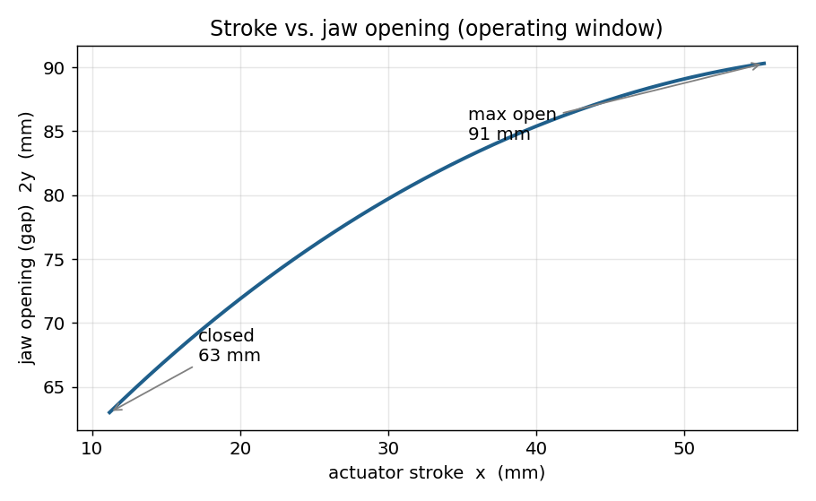
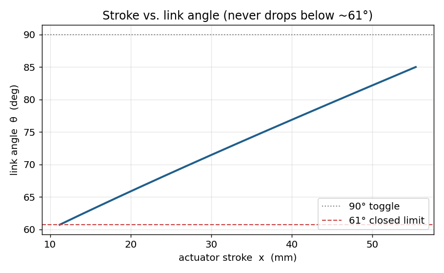
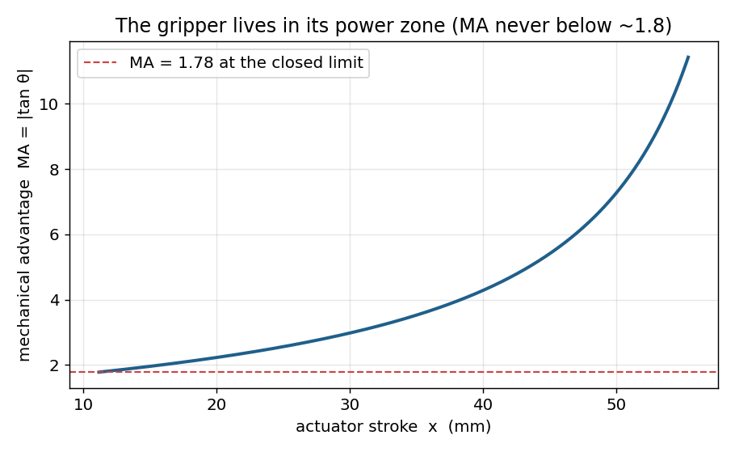
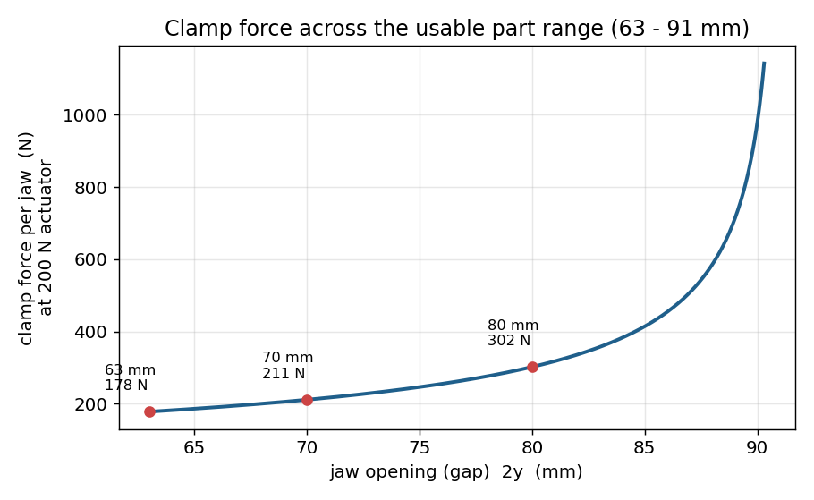

# Gripper Kinematics

Closed-form kinematic and mechanical-advantage analysis of a linear-actuator,
parallel-jaw gripper modeled in SolidWorks. One linear actuator drives twin
links that slide both fingers closed on guide rods. This repo works out, by hand
and then in Python, how far it opens and how hard it can squeeze.

Project writeup: https://anuragbhandari.vercel.app/projects/robotic-gripper-assembly

## The model

The linkage has one degree of freedom, so it solves in closed form. Stroke `x`
sets the link angle `θ`, the link angle sets the jaw half-opening `y`, and virtual
work turns that into mechanical advantage.

```
cos θ = ( (L − L2) − x ) / L1
y     = L1·sin θ − (K − h)
MA    = | tan θ |
```

Geometry (mm): L1 = 110 (drive link, taken straight off the STEP file), L = 315.94,
L2 = 250.94, K = 89.43, h = 25.

## What the analysis found

The jaws bottom out at a 63 mm gap because the actuator runs out of retract travel,
and they open to 91 mm at the toggle, so the gripper handles parts 63–91 mm wide.
Across that whole range the link angle stays above 60°, which keeps it in the strong
half of the toggle. On a 200 N actuator:

| part width | link angle θ | MA | clamp force per finger |
|---|---|---|---|
| 63 mm (closed limit) | 60.7° | 1.78 | 178 N |
| 70 mm | 64.7° | 2.11 | 211 N |
| 80 mm | 71.7° | 3.02 | 302 N |
| 90 mm (near full open) | 84.2° | 9.79 | 979 N |

Worst-case drive-link load is about 980 N, which is roughly 6 MPa on ø10 steel pins
in double shear, far under the limit. The trade-offs: a narrow 28 mm part range, and
force that swings about 5.5× across it. Lowering the 63 mm floor is an actuator or
mounting change; flattening the force curve would need a wedge or cam stage instead
of a toggle.

## Plots






## Running it

```
pip install numpy matplotlib
python gripper_analysis.py
```

That prints the operating summary and the grip-force table, and writes the four
plots above. Change the actuator thrust by passing a different value to
`print_summary()` and `make_plots()` at the bottom of the script.
