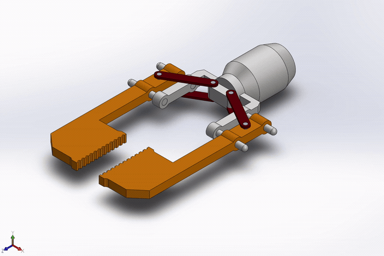
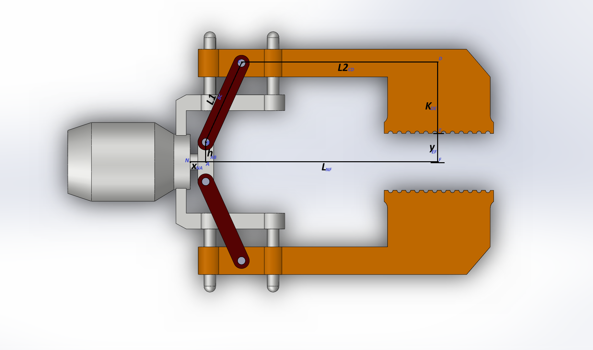

# Gripper Kinematics

> Closed-form kinematic and mechanical-advantage analysis of a linear-actuator parallel-jaw gripper. Modeled in SolidWorks, solved by hand, verified in Python.

<p align="center">
  
</p>

**At a glance** — one actuator, two fingers, self-centering. It handles parts **63–91 mm** wide and delivers **178–979 N of clamp force per finger** on a 200 N actuator, with a mechanical advantage that never drops below **1.8** anywhere in its travel.

📄 Full writeup: **[anuragbhandari.vercel.app/projects/robotic-gripper-assembly](https://anuragbhandari.vercel.app/projects/robotic-gripper-assembly)**

*Tools: SolidWorks · Python (NumPy, Matplotlib)*

---

## How it works

A single linear actuator pushes a slider along the centerline. Twin symmetric links carry that motion out to two jaws, and the jaws ride on vertical guide rods so they translate straight in and out, staying parallel. Because both links come off the same slider, the part centers itself.

---

## The model

The linkage has one degree of freedom, so it solves in closed form. The stroke $x$ sets the link angle $\theta$, and the link angle sets the jaw half-opening $y$.

<p align="center">
  
</p>

<p align="center"><em>Drive link <code>L1</code> (pin B→C), jaw arm <code>L2</code>, vertical drop <code>K</code>, pin offset <code>h</code>, link angle <code>θ</code>, stroke <code>x</code>, half-opening <code>y</code>.</em></p>

Every symbol on the diagram maps to one row below:

| symbol | meaning | value (mm) |
| :--- | :--- | ---: |
| $L_1$ | drive link, pin B → pin C *(from the STEP file)* | 110.00 |
| $L$ | datum → gripping surface | 315.94 |
| $L_2$ | jaw horizontal arm, pin C → corner D | 250.94 |
| $K$ | jaw vertical drop, corner D → surface E | 89.43 |
| $h$ | centerline → slider pin B offset | 25.00 |

Closing the linkage loop horizontally and vertically, then differentiating with virtual work, gives three relations:

$$\cos\theta = \frac{(L - L_2) - x}{L_1}$$

$$y = L_1 \sin\theta - (K - h)$$

$$\mathrm{MA} = \left|\ \tan\theta \ \right|$$

That last term is the whole story: this is a **toggle**. Mechanical advantage climbs toward infinity as the link angle approaches 90°, so the linkage is strongest near full open.

<p align="center">
  
  
</p>

<p align="center"><em>The closed-form relations, plotted across the working stroke.</em></p>

---

## Results

The jaws bottom out at a **63 mm gap** because the actuator runs out of retract travel before the linkage does, and they open to **91 mm** at the toggle. So the gripper handles parts 63–91 mm wide, and across that whole range the link angle stays above 60° — it never sits in the weak half of the toggle.

On a 200 N actuator:

| part width | link angle $\theta$ | MA | clamp force / finger | link load |
| :--- | ---: | ---: | ---: | ---: |
| 63 mm *(closed limit)* | 60.7° | 1.78 | 178 N | 204 N |
| 70 mm | 64.7° | 2.11 | 211 N | 234 N |
| 80 mm | 71.7° | 3.02 | 302 N | 318 N |
| 90 mm *(near full open)* | 84.2° | 9.79 | 979 N | 984 N |

<p align="center">
  
  
</p>

<p align="center"><em>Mechanical advantage stays high across the range (left); clamp force per finger rises from 178 N to nearly 1 kN toward full open (right).</em></p>

The worst-case drive-link load of ~980 N works out to about 6 MPa on ø10 steel pins in double shear, far under the limit — the pins are nowhere near the constraint. The real trade-offs are a **narrow 28 mm part range** and a clamp force that **swings ~5.5× across it**. Lowering the 63 mm floor is an actuator or mounting change, not a linkage one; flattening the force curve would mean a wedge or cam stage instead of a toggle.

---

## Running it

```bash
pip install numpy matplotlib
python gripper_analysis.py
```

This prints the operating summary and the grip-force table, and regenerates the four plots above. To analyze a different actuator, pass the thrust to `print_summary()` and `make_plots()` at the bottom of the script.
